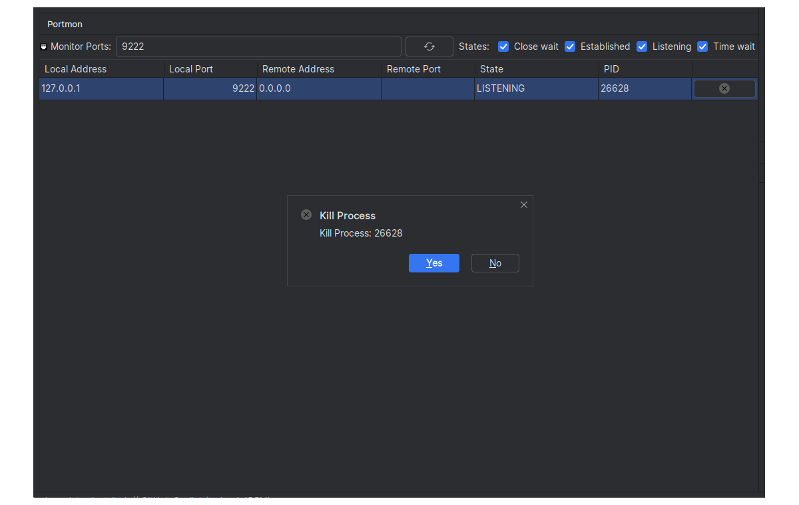

# Portmon

A simple port monitor with ability to kill process owning the port.

## Features

NOTE: Works on linux and windows only for now.

- filter by port state
  - CLOSE_WAIT
  - ESTABLISHED
  - LISTEN
  - TIME_WAIT

- filter using comma separated list of port numbers
- remember the settings
- kill process after confirmation by the user
- Sorting
  - Default sort on local port